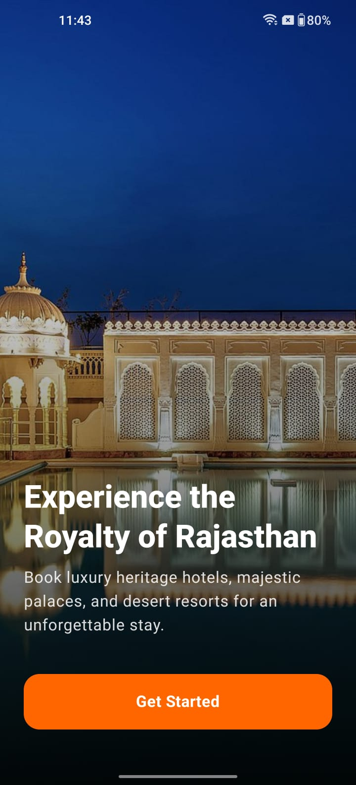
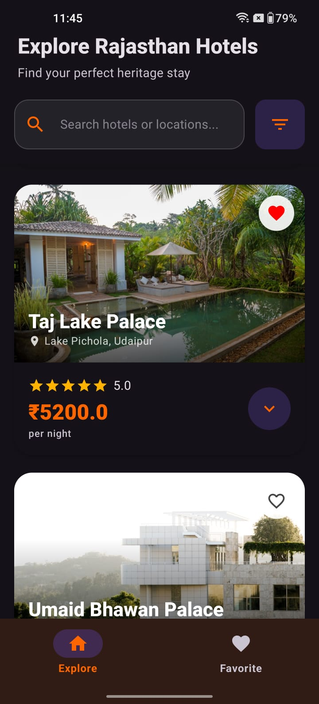
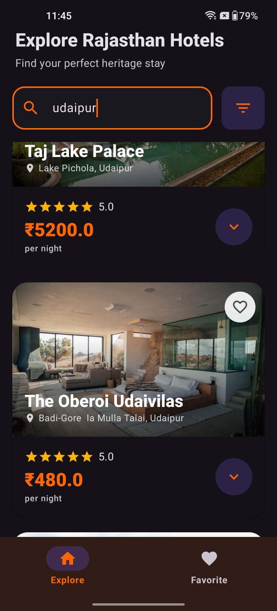
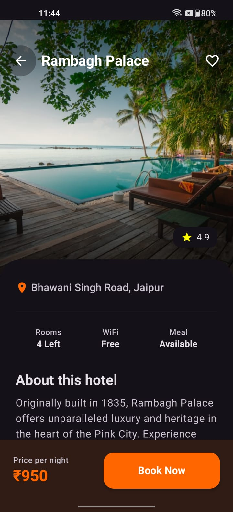
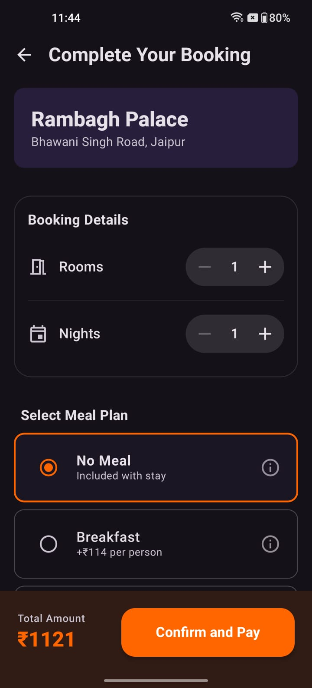
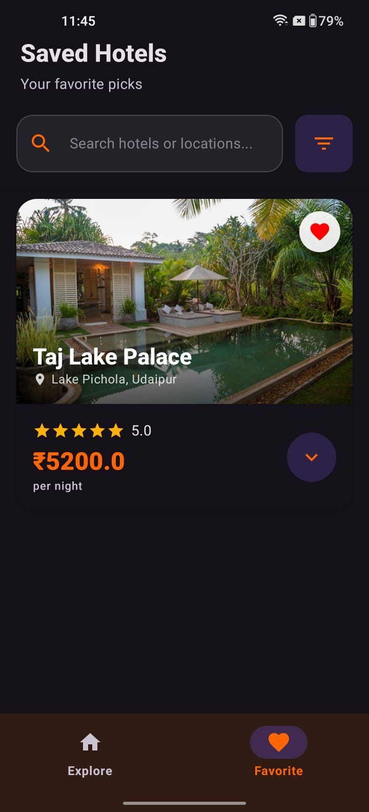

# Rajasthan Hotel Booking App

A modern, high-performance Android application built entirely with Jetpack Compose. This app allows users to seamlessly explore, configure, and mock-book luxury heritage hotels across Rajasthan.

Built with an **Offline-First Architecture**, the app guarantees a buttery-smooth user experience regardless of network conditions.


## Key Features

* **Offline-First Browsing:** Instant loading and scrolling powered by Room Database and Paging 3 `RemoteMediator`.
* **Swipeable Navigation:** Smooth horizontal pager integration bridging the 'Explore' and 'Favorites' tabs.
* **Reactive Price Calculator:** Real-time dynamic pricing engine that instantly recalculates grand totals, taxes, and limits based on room, night, and meal plan selections.
* **Integrated Payments:** Native checkout sheet integration using the Razorpay Android SDK (Test Mode Only).
* **Optimized Search & Sort:** Zero-lag database sorting and debounced search inputs to prevent UI freezing.

## Project Setup Instructions

1. **Clone the Repository**:
```bash
git clone https://github.com/ItzYashvardhan/RajasthanHotelBookingApp

```

1. **Open in Android Studio**: Open the project using Android Studio Panda 4 (2025.3.4) or newer.
2. **Gradle Sync**: Allow the project to sync and download all necessary dependencies.
3. **API & Payment Configuration**:
    - **Network Requirement**: A stable internet connection is strictly required to fetch hotel data from the backend server and process mock transactions.
    - **Test Payments**: The app currently utilizes a hardcoded Razorpay Test Key (`rzp_test_...`) for evaluation purposes.
4. **Run the App**: Build and deploy on an emulator or physical device (Min SDK: 24, Target SDK: 36).

---

## Architecture Overview

This project follows the **MVVM (Model-View-ViewModel)** architectural pattern and the **Single Source of Truth (SSOT)** principle, emphasizing a strict separation of concerns through **Unidirectional Data Flow (UDF)**.

* **UI Layer (Stateless)**:
* Built declaratively with **Jetpack Compose**.
* Implements the **Route-to-Screen Pattern**: ViewModels are scoped exclusively to the `NavHost` route level. The routes extract state flows and pass *only* immutable data and event lambdas down to the UI components.
* Screens contain absolutely zero business logic and no stateful dependencies. They are mathematically pure functions, rendering them 100% previewable in Android Studio and highly testable.


* **ViewModel & State Layer**:
* Acts as the bridge between user intents and the data layer, exposing UI states via Kotlin `StateFlow`.
* Complex business logic and calculations (e.g., real-time tax and room cost math) are pushed down into dedicated State Data Classes (like `BookingState`). This keeps ViewModels lean and prevents "business logic leaks" into the Compose UI.


* **Data Layer (Repository Pattern)**:
* **Remote**: Leverages **Retrofit** to fetch raw hotel JSON data, isolating network boundaries using dedicated DTOs.
* **Local**:
    * **Room Database** for persistent offline caching and managing `Favorite` states locally.
    * **DataStore**" for persisting data of "has_seen_splash_screen"
* **Pagination**: Implements **Paging 3** with a `RemoteMediator`. The UI strictly observes the local Room database, while the mediator seamlessly orchestrates network fetching in the background.

---

## Tech Stack & Libraries

**Core UI & Navigation**

* [Jetpack Compose](https://developer.android.com/compose) - Modern declarative UI toolkit.
* [Navigation Compose](https://www.google.com/search?q=https://developer.android.com/jetpack/compose/navigation) - Type-safe routing and screen transitions.
* [Splash Screen API](https://developer.android.com/develop/ui/views/launch/splash-screen) - Native launch animations.

**Architecture & State**

* [Hilt (Dagger)](https://dagger.dev/hilt/) - Dependency Injection.
* [Kotlin Coroutines & Flows](https://kotlinlang.org/docs/coroutines-overview.html) - Asynchronous programming and reactive streams.
* [Preferences DataStore](https://developer.android.com/topic/libraries/architecture/datastore) - Asynchronous local preference storage (Onboarding state).

**Data & Network**

* [Room](https://developer.android.com/training/data-storage/room) - SQLite object mapping and local persistence.
* [Paging 3](https://developer.android.com/topic/libraries/architecture/paging/v3-overview) - Advanced pagination and list loading.
* [Retrofit](https://square.github.io/retrofit/) - REST API communication.
* [Kotlinx Serialization](https://github.com/Kotlin/kotlinx.serialization) - JSON parsing.

**Third-Party Integrations**

* [Coil 3](https://coil-kt.github.io/coil/) - High-performance image loading and caching.
* [Razorpay Android SDK](https://razorpay.com/docs/payments/payment-gateway/android-integration/standard/) - Checkout gateway.

---

## State Management & Optimizations

* **Unidirectional Data Flow (UDF)**: User intents flow strictly upward to the ViewModel, and state flows strictly downward to the Compose UI.
* **Flow Combinations**: Uses `combine` and `flatMapLatest` to intelligently merge user search queries and sort preferences, passing them directly into the Room DAO.

---

## Assumptions & Constraints

* **Sorting Strategy**: All sorting (Price, Rating) is handled explicitly at the SQL level via dedicated DAO queries to guarantee performance on large datasets.
* **Payment Environment**: The Razorpay SDK is configured for Sandbox testing. No real currency is exchanged. Use standard Razorpay test credentials (e.g., OTP: 123456) to simulate Success/Failed bookings.
* **Mock Data Restrictions**: While the app searches and filters seamlessly, offline image viewing depends on Coil's internal memory caching of previously loaded URLs.

## 📸 App Showcase

### Screenshots

### Discovery & Search





### Details & Booking


